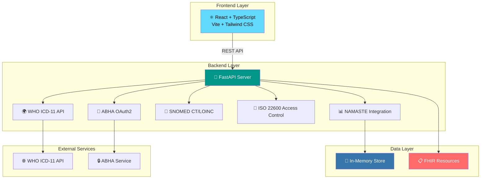

<div align="center">

# 🏥 ICD-Mapping: Ayush Healthcare Interoperability Platform

### 🌿 Bridging Traditional Medicine with Modern Healthcare Standards

[](https://icd-mapping.onrender.com)
[](https://www.python.org/)
[](https://fastapi.tiangolo.com/)
[](https://reactjs.org/)
[](https://www.typescriptlang.org/)
[](https://www.hl7.org/fhir/)
[](https://icd.who.int/)


**🚀 [Visit Live Application](https://icd-mapping.onrender.com) | 📚 [API Documentation](https://icd-mapping.onrender.com/docs) | 🎯 [Backend Repo](ayush-fhir/) | ⚡ [Frontend Repo](ayush-fhir-sparkle/)**

</div>

---

## 📋 Table of Contents

- [✨ Overview](#-overview)
- [🎯 Problem Statement](#-problem-statement)
- [🌟 Key Features](#-key-features)
- [🏗️ Architecture](#️-architecture)
- [🛠️ Tech Stack](#️-tech-stack)
- [🚀 Quick Start](#-quick-start)
- [📦 Project Structure](#-project-structure)
- [🌐 Deployment](#-deployment)
- [📡 API Endpoints](#-api-endpoints)
- [🎨 Screenshots](#-screenshots)
- [🤝 Contributing](#-contributing)
- [📄 License](#-license)

---

## ✨ Overview

**ICD-Mapping** is a comprehensive healthcare interoperability platform that enables seamless integration between India's traditional **Ayush systems** (Ayurveda, Yoga, Unani, Siddha, Homeopathy) and modern global healthcare standards through **FHIR R4** compliance and **ICD-11** dual coding.

### 🎯 Why ICD-Mapping?

| Benefit | Description |
|---------|-------------|
| 🔄 **Interoperability** | Enable clinicians across different systems to understand patient records |
| 📊 **Analytics** | Support public health analytics spanning traditional and biomedical medicine |
| 💰 **Insurance** | Make Ayush treatments reimbursable through ICD-11 coding |
| ✅ **Compliance** | Full adherence to India's 2016 EHR Standards and FHIR R4 |
| 🌍 **Global Standards** | Integration with WHO ICD-11, SNOMED CT, and LOINC |

---

## 🎯 Problem Statement

Traditional Ayush healthcare systems in India face critical challenges in interoperability with modern healthcare infrastructure. This platform addresses:

- **🔗 Data Exchange**: Lack of standardized terminology mapping between Ayush and biomedical systems
- **📋 Insurance Claims**: Difficulty in processing insurance claims for traditional treatments
- **📊 Public Health**: Limited ability to analyze health trends across traditional and modern medicine
- **🏥 Clinical Integration**: Challenges in sharing patient records between Ayush and allopathic practitioners

### 💡 Our Solution

ICD-Mapping implements **dual/double coding** that maps NAMASTE (National Ayush Morbidity And Standardized Terminologies Electronic) codes to:

- 🌿 **WHO ICD-11 Traditional Medicine (TM2)** linearization
- 💊 **WHO ICD-11 Biomedicine** codes
- 🧬 **SNOMED CT** clinical findings
- 🧪 **LOINC** laboratory tests

---

## 🌟 Key Features

### 🔥 Core Capabilities

- ✅ **FHIR R4 Compliant** - Full HL7 FHIR R4 protocol implementation
- ✅ **Dual Coding System** - NAMASTE ↔ ICD-11 bidirectional translation
- ✅ **AI-Powered Mapping** - Confidence-scored suggestions for term mapping
- ✅ **WHO ICD-11 Integration** - Real-time API integration with WHO terminology
- ✅ **SNOMED CT/LOINC** - Semantic coding for clinical findings and lab tests
- ✅ **CSV Data Ingestion** - Bulk upload and validation of terminology datasets
- ✅ **Auto-complete Search** - Fuzzy matching with typo tolerance
- ✅ **Multi-language Support** - English and Hindi terminology support

### 🔐 Security & Compliance

- ✅ **ABHA OAuth2** - Ayushman Bharat Health Account authentication
- ✅ **ISO 22600 Access Control** - Consent-based privilege management
- ✅ **Audit Trails** - Complete AuditEvent and Provenance tracking
- ✅ **Version Control** - Resource versioning and update timestamps

### 📊 Analytics & Visualization

- ✅ **Interactive Dashboard** - Real-time statistics and charts giving a snapshot of the system's health and usage.
- ✅ **Dual Coding Coverage** -  A key metric showing the percentage of NAMASTE terms that have been successfully mapped to ICD-11, SNOMED CT, or LOINC. This percentage helps track the progress of interoperability efforts.
- ✅ **Top Terms Analysis** - A dynamic bar chart visualizing the most frequently accessed or mapped NAMASTE terms, helping to identify high-priority conditions for resource allocation.
- ✅ **Usage Patterns** - System monitoring and insights to understand how practitioners are interacting with the platform.

---

## 🏗️ Architecture

### 🔧 System Architecture



### 📦 Component Overview

| Component | Technology | Purpose |
|-----------|-----------|---------|
| **Frontend** | React 18 + TypeScript + Vite | Modern, responsive UI with real-time updates |
| **Backend** | FastAPI (Python 3.11+) | High-performance REST API server |
| **FHIR Engine** | Custom FHIR R4 Implementation | CodeSystem, ConceptMap, Condition resources |
| **Authentication** | OAuth2 + JWT | ABHA integration and access control |
| **Data Storage** | In-memory (Production: PostgreSQL) | Fast terminology lookups |
| **Deployment** | Render.com | Cloud hosting with auto-scaling |

---

## 🛠️ Tech Stack

### 🔙 Backend (ayush-fhir)

| Technology | Version | Purpose |
|------------|---------|---------|
|  | 3.11+ | Core language |
|  | 0.100+ | Web framework |
|  | Latest | ASGI server |
|  | Latest | Data validation |

### 🎨 Frontend (ayush-fhir-sparkle)

| Technology | Version | Purpose |
|------------|---------|---------|
|  | 18.x | UI library |
|  | 5.x | Type safety |
|  | 5.x | Build tool |
|  | 3.x | Styling |
|  | Latest | Data visualization |

### 📋 Standards & Protocols

- 🏥 **FHIR R4** - Fast Healthcare Interoperability Resources
- 🌍 **ICD-11** - WHO International Classification of Diseases
- 🧬 **SNOMED CT** - Systematized Nomenclature of Medicine
- 🧪 **LOINC** - Logical Observation Identifiers Names and Codes
- 🔒 **ISO 22600** - Health informatics privilege management
- 🔑 **OAuth 2.0** - Authorization framework

---

## 🚀 Quick Start

### 📋 Prerequisites

- 🐍 **Python 3.11+** - [Download](https://www.python.org/)
- 📦 **Node.js 16+** - [Download](https://nodejs.org/)
- 🔧 **Git** - [Download](https://git-scm.com/)

### 🔧 Installation

#### 1️⃣ Clone the Repository

```bash
git clone <YOUR_REPO_URL>
cd ICD-Mapping
```

#### 2️⃣ Backend Setup (ayush-fhir)

```bash
# Navigate to backend directory
cd ayush-fhir

# Create virtual environment
python -m venv venv

# Activate virtual environment
# Windows:
venv\Scripts\activate
# Linux/Mac:
source venv/bin/activate

# Install dependencies
pip install -r requirements.txt

# Start the backend server
uvicorn app.main:app --reload --host 0.0.0.0 --port 8000
```

**Backend will be available at:** `http://localhost:8000`

#### 3️⃣ Frontend Setup (ayush-fhir-sparkle)

```bash
# Open a new terminal and navigate to frontend directory
cd ayush-fhir-sparkle

# Install dependencies
npm install

# Start the development server
npm run dev
```

**Frontend will be available at:** `http://localhost:5173`

### 🌐 Access the Application

| Service | URL | Description |
|---------|-----|-------------|
| 🏠 **Frontend UI** | <http://localhost:5173> | Main application interface |
| 🔌 **Backend API** | <http://localhost:8000> | REST API server |
| 📚 **API Docs** | <http://localhost:8000/docs> | Interactive Swagger documentation |
| 🔍 **ReDoc** | <http://localhost:8000/redoc> | Alternative API documentation |
| ❤️ **Health Check** | <http://localhost:8000/health> | Server health status |

---

## 📦 Project Structure

```
ICD-Mapping/
├── 📁 ayush-fhir/                    # Backend (FastAPI)
│   ├── 📁 app/
│   │   ├── main.py                   # FastAPI application entry
│   │   ├── api.py                    # API endpoints
│   │   ├── fhir_resources.py         # FHIR resource generation
│   │   ├── who_api.py                # WHO ICD-11 integration
│   │   ├── snomed_loinc.py           # SNOMED CT/LOINC integration
│   │   ├── iso_22600.py              # Access control
│   │   ├── storage.py                # Data storage
│   │   └── ingest.py                 # CSV ingestion
│   ├── 📁 data/                      # NAMASTE datasets
│   ├── 📁 static/                    # Static files
│   ├── requirements.txt              # Python dependencies
│   ├── cli.py                        # CLI interface
│   └── README.md                     # Backend documentation
│
├── 📁 ayush-fhir-sparkle/            # Frontend (React + TypeScript)
│   ├── 📁 src/
│   │   ├── 📁 components/            # React components
│   │   ├── 📁 pages/                 # Page components
│   │   ├── 📁 config/                # Configuration
│   │   ├── 📁 lib/                   # Utilities
│   │   ├── 📁 hooks/                 # Custom hooks
│   │   ├── App.tsx                   # Main app component
│   │   ├── main.tsx                  # Entry point
│   │   └── index.css                 # Global styles
│   ├── 📁 public/                    # Static assets
│   ├── package.json                  # Node dependencies
│   ├── vite.config.ts                # Vite configuration
│   ├── tailwind.config.ts            # Tailwind configuration
│   └── README.md                     # Frontend documentation
│
├── render.yaml                       # Render deployment config
├── requirements.txt                  # Root Python dependencies
└── README.md                         # This file
```

---

## 🌐 Deployment

### 🚀 Live Application

**🌐 Production URL:** [https://icd-mapping.onrender.com](https://icd-mapping.onrender.com)

### ☁️ Deployment Platform: Render.com

This application is deployed on **Render** with the following configuration:

#### Backend Service

- **Type:** Web Service
- **Environment:** Python 3.11
- **Region:** Oregon
- **Build Command:** `pip install -r requirements.txt`
- **Start Command:** `uvicorn app.main:app --host 0.0.0.0 --port $PORT`

#### Frontend Service

- **Type:** Static Site
- **Build Command:** `npm install && npm run build`
- **Publish Directory:** `dist`

### 📝 Deployment Configuration

The `render.yaml` file contains the complete deployment configuration for both services.

### 🔄 Auto-Deployment

- ✅ Automatic deployments on Git push
- ✅ Zero-downtime deployments
- ✅ Automatic HTTPS/SSL certificates
- ✅ Environment variable management

---

## 📡 API Endpoints

### 🔤 Core Terminology

| Endpoint | Method | Description |
|----------|--------|-------------|
| `/search?q={term}` | GET | 🔍 Search NAMASTE terms with fuzzy matching |
| `/suggest?q={term}` | GET | 🤖 AI-powered suggestions with confidence scores |
| `/translate?code={code}&system={namaste\|icd11}` | GET | 🔄 Bidirectional translation |
| `/codesystem` | GET | 📋 FHIR CodeSystem for NAMASTE terms |
| `/conceptmap` | GET | 🗺️ FHIR ConceptMap NAMASTE → ICD-11 |

### 🌍 WHO ICD-11 Integration

| Endpoint | Method | Description |
|----------|--------|-------------|
| `/who/tm2/search?q={term}` | GET | 🌿 Search WHO ICD-11 TM2 entities |
| `/who/biomedicine/search?q={term}` | GET | 💊 Search WHO ICD-11 Biomedicine |

### 🔬 SNOMED CT / LOINC

| Endpoint | Method | Description |
|----------|--------|-------------|
| `/snomed/search?q={term}` | GET | 🧬 Search SNOMED CT concepts |
| `/loinc/search?q={term}` | GET | 🧪 Search LOINC codes |

### 📋 FHIR Resources

| Endpoint | Method | Description |
|----------|--------|-------------|
| `/fhir/problem-list?namaste_code={code}` | POST | 🏥 Create dual-coded Problem List entry |
| `/ingest-bundle` | POST | 📦 Ingest FHIR Bundle with validation |
| `/ingest-csv` | POST | 📤 Upload CSV data |
| `/ingest-default` | POST | 📥 Load default 200-record dataset |

### 🔐 Security & Compliance

| Endpoint | Method | Description |
|----------|--------|-------------|
| `/auth?abha_id={id}` | POST | 🔑 Mock ABHA authentication |
| `/access-check` | POST | 🔒 ISO 22600 access control validation |
| `/audit` | GET | 📜 Retrieve AuditEvent logs |
| `/provenance` | GET | 🔍 Retrieve Provenance metadata |

### 📊 Analytics

| Endpoint | Method | Description |
|----------|--------|-------------|
| `/stats/top-terms` | GET | 📈 Top NAMASTE terms by frequency |
| `/stats/dual-coding-rate` | GET | 📊 Dual coding coverage statistics |

**📚 Complete API Documentation:** [https://icd-mapping.onrender.com/docs](https://icd-mapping.onrender.com/docs)

---

## 🎨 Screenshots

> **Note:** Visit the [live application](https://icd-mapping.onrender.com) to see the platform in action!

### Key Features

- 📊 **Interactive Dashboard** with real-time analytics
- 🔍 **Smart Search** with auto-complete and fuzzy matching
- 🔄 **Dual Coding Interface** for NAMASTE ↔ ICD-11 translation
- 📤 **CSV Upload** with drag-and-drop functionality
- 🏥 **FHIR Problem List** creation with multiple coding systems
- 📈 **Analytics Charts** showing usage patterns and coverage

---

## 🤝 Contributing

We welcome contributions! Here's how you can help:

### 📝 Contribution Guidelines

1. 🍴 **Fork the repository**
2. 🌿 **Create a feature branch** (`git checkout -b feature/AmazingFeature`)
3. 💾 **Commit your changes** (`git commit -m 'Add some AmazingFeature'`)
4. 📤 **Push to the branch** (`git push origin feature/AmazingFeature`)
5. 🎉 **Open a Pull Request**

### 🔧 Development Guidelines

- Use **Python 3.11+** for backend development
- Follow **PEP 8** style guide for Python code
- Use **TypeScript** for frontend development
- Follow **React best practices** and hooks patterns
- Write **meaningful commit messages**
- Add **comments** for complex logic
- Test your changes thoroughly

### 🐛 Bug Reports

Found a bug? Please open an issue with:

- Clear description of the problem
- Steps to reproduce
- Expected vs actual behavior
- Screenshots if applicable

---

## 📄 License

This project is developed for the **Ministry of Ayush** hackathon and demonstrates interoperability between traditional Indian medicine and global healthcare standards.

**Category:** Software | **Theme:** MedTech / BioTech / HealthTech

---

## 🏆 Acknowledgments

### 🙏 Built For

- **Ministry of Ayush** - Government of India
- **All India Institute of Ayurveda (AIIA)**

### 🌟 Standards & Organizations

- **HL7 International** - FHIR R4 Standards
- **World Health Organization (WHO)** - ICD-11 Classification
- **SNOMED International** - Clinical Terminology
- **Regenstrief Institute** - LOINC Codes

### 💡 Special Thanks

- Healthcare interoperability community
- Open source contributors
- FHIR community

---

<div align="center">

### 🌟 Built with ❤️ for Better Healthcare Interoperability

**🚀 [Visit Live Application](https://icd-mapping.onrender.com)**

[](https://github.com/your-repo)
[](https://icd-mapping.onrender.com/docs)
[](LICENSE)

---

**[⬆ Back to Top](#-icd-mapping-ayush-healthcare-interoperability-platform)**

</div>
