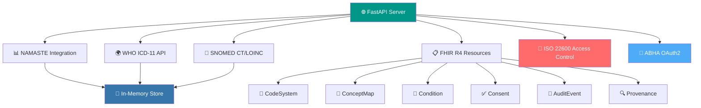

<div align="center">

# 🏥 Ayush FHIR Backend

### 🔬 FHIR R4-Compliant Terminology Microservice

[](https://www.python.org/)
[](https://fastapi.tiangolo.com/)
[](https://www.hl7.org/fhir/)
[](https://icd.who.int/)


</div>

---

## 📋 Table of Contents

- [🎯 Problem Statement](#-problem-statement)
- [✨ Key Features](#-key-features)
- [🏗️ Architecture](#️-architecture)
- [🚀 Quick Start](#-quick-start)
- [📡 API Endpoints](#-api-endpoints)
- [🖥️ CLI Interface](#️-cli-interface)
- [📊 FHIR Resources](#-fhir-resources)
- [🔒 Security & Compliance](#-security--compliance)
- [📈 Analytics](#-analytics)
- [🚀 Deployment](#-deployment)
- [📚 Standards Compliance](#-standards-compliance)
- [🤝 Contributing](#-contributing)

---

## 🎯 Problem Statement

This project addresses the **critical need for interoperability** between India's Ayush sector (Ayurveda, Siddha, Unani) and global healthcare systems by implementing **dual/double coding** that enables:

### 🌟 Core Benefits

| Benefit | Description |
|---------|-------------|
| 🔄 **Interoperability** | Clinicians across systems can understand patient records |
| 📊 **Analytics** | Public health analytics spanning traditional and biomedical medicine |
| 💰 **Insurance** | Ayush treatments become reimbursable through ICD-11 coding |
| ✅ **Compliance** | Full adherence to India's 2016 EHR Standards |

---

## ✨ Key Features

### ✅ MVP (Must-Have)

- ✅ **NAMASTE CSV Ingestion** - Load 200-record dataset with validation
- ✅ **FHIR CodeSystem Generation** - Convert NAMASTE terms to FHIR CodeSystem
- ✅ **FHIR ConceptMap Generation** - Map NAMASTE → ICD-11 TM2
- ✅ **Auto-complete Endpoint** - Search with fuzzy matching and typo tolerance
- ✅ **Translate Operation** - Bidirectional NAMASTE ↔ ICD-11 translation

### ✅ V1 (Should-Have)

- ✅ **FHIR Bundle Ingest** - Accept Patient, Practitioner, Encounter, Condition resources
- ✅ **Mock ABHA OAuth** - Simulate ABHA authentication flow
- ✅ **Audit/Provenance** - Capture AuditEvent and Provenance metadata
- ✅ **WHO ICD-11 API** - OAuth2 client credentials integration
- ✅ **SNOMED CT/LOINC** - Semantic coding for clinical findings and lab tests

### ✅ V2 (Could-Have)

- ✅ **ISO 22600 Access Control** - Consent-based privilege management
- ✅ **Version Tracking** - Resource versioning and update timestamps
- ✅ **CLI Interface** - Command-line testing and demonstration
- ✅ **Enhanced UI** - Responsive design with comprehensive feature coverage

### ✅ V3 (Wow Factor)

- ✅ **AI-Powered Mapping** - Confidence scoring for term suggestions
- ✅ **Multi-language Support** - Hindi synonyms and fuzzy matching
- ✅ **Interactive Dashboard** - Real-time analytics and visualization
- ✅ **Dual Coding Problem List** - FHIR Condition with multiple coding systems

---

## 🏗️ Architecture

### 🔧 Core Components



### 🛠️ Technology Stack

| Component | Technology |
|-----------|-----------|
| 🐍 **Backend** | FastAPI (Python 3.8+) |
| 🎨 **Frontend** | Responsive HTML5 with Tailwind CSS + Chart.js |
| 📋 **Standards** | FHIR R4, ISO 22600, OAuth2, SNOMED CT, LOINC |
| 💾 **Data** | CSV ingestion, in-memory storage, WHO API integration |

---

## 🚀 Quick Start

### 📋 Prerequisites

- 🐍 **Python 3.8+** - [Download](https://www.python.org/)
- 📦 **pip** - Python package manager (comes with Python)

### 🔧 Installation

```bash
# 1️⃣ Navigate to project directory
cd Ayush-FHIR

# 2️⃣ Create virtual environment
python -m venv venv

# 3️⃣ Activate virtual environment
# Windows:
venv\Scripts\activate
# Linux/Mac:
source venv/bin/activate

# 4️⃣ Install dependencies
pip install -r requirements.txt

# 5️⃣ Start the server
python -m uvicorn app.main:app --reload
```

### 🌐 Access the Application

| Service | URL | Description |
|---------|-----|-------------|
| 🏠 **Web UI** | http://127.0.0.1:8000/ | Main application interface |
| 📚 **API Docs** | http://127.0.0.1:8000/docs | Interactive Swagger documentation |
| 🔍 **ReDoc** | http://127.0.0.1:8000/redoc | Alternative API documentation |
| ❤️ **Health Check** | http://127.0.0.1:8000/health | Server health status |

---

## 📡 API Endpoints

### 🔤 Core Terminology

| Endpoint | Method | Description |
|----------|--------|-------------|
| `/search?q={term}` | GET | 🔍 Search NAMASTE terms with fuzzy matching |
| `/suggest?q={term}` | GET | 🤖 AI-powered suggestions with confidence scores |
| `/translate?code={code}&system={namaste\|icd11}` | GET | 🔄 Bidirectional translation |
| `/codesystem` | GET | 📋 FHIR CodeSystem for NAMASTE terms |
| `/conceptmap` | GET | 🗺️ FHIR ConceptMap NAMASTE → ICD-11 |

### 🌍 WHO ICD-11 Integration

| Endpoint | Method | Description |
|----------|--------|-------------|
| `/who/tm2/search?q={term}` | GET | 🌿 Search WHO ICD-11 TM2 entities |
| `/who/biomedicine/search?q={term}` | GET | 💊 Search WHO ICD-11 Biomedicine |

### 🔬 SNOMED CT / LOINC

| Endpoint | Method | Description |
|----------|--------|-------------|
| `/snomed/search?q={term}` | GET | 🧬 Search SNOMED CT concepts |
| `/loinc/search?q={term}` | GET | 🧪 Search LOINC codes |

### 📋 FHIR Resources

| Endpoint | Method | Description |
|----------|--------|-------------|
| `/fhir/problem-list?namaste_code={code}` | POST | 🏥 Create dual-coded Problem List entry |
| `/ingest-bundle` | POST | 📦 Ingest FHIR Bundle with validation |
| `/consent?patient_id={id}` | POST | ✅ Create FHIR Consent resource |

### 🔐 Security & Compliance

| Endpoint | Method | Description |
|----------|--------|-------------|
| `/auth?abha_id={id}` | POST | 🔑 Mock ABHA authentication |
| `/access-check` | POST | 🔒 ISO 22600 access control validation |
| `/audit` | GET | 📜 Retrieve AuditEvent logs |
| `/provenance` | GET | 🔍 Retrieve Provenance metadata |

### 📊 Analytics

| Endpoint | Method | Description |
|----------|--------|-------------|
| `/stats/top-terms` | GET | 📈 Top NAMASTE terms by frequency |
| `/stats/dual-coding-rate` | GET | 📊 Dual coding coverage statistics |

---

## 🖥️ CLI Interface

The project includes a comprehensive CLI for testing and demonstration:

```bash
# 🔍 Search NAMASTE terms
python cli.py search --query "Amlapitta"

# 🔄 Translate between systems
python cli.py translate --code "AY001" --system "namaste"

# 🤖 Get AI suggestions
python cli.py suggest --query "dyspepsia"

# 🌿 Search WHO ICD-11 TM2
python cli.py who-tm2 --query "dyspepsia"

# 🧬 Search SNOMED CT
python cli.py snomed --query "stomach"

# 🧪 Search LOINC
python cli.py loinc --query "glucose"

# 🏥 Create Problem List entry
python cli.py problem-list --code "AY001"

# 🔒 Check access control
python cli.py access --subject "doctor-001" --action "read" --resource "Condition"

# 🎬 Run complete demo
python cli.py demo
```

---

## 🎯 Demo Workflow

### 1️⃣ Data Ingestion
- Click **"Load default 200 records"** to ingest NAMASTE dataset
- Verify ingestion: `{"ingested": 200, "source": "namaste_200.csv"}`

### 2️⃣ Terminology Search & Translation
- **Search**: Type "Amlapitta" → see exact/partial matches
- **AI Suggest**: Get confidence-scored suggestions
- **Translate**: AY001 (namaste) → TM2-AY134 (icd11)

### 3️⃣ WHO ICD-11 Integration
- Search TM2 entities for traditional medicine terms
- Search Biomedicine entities for standard medical terms

### 4️⃣ SNOMED CT / LOINC Integration
- Search clinical findings in SNOMED CT
- Search laboratory tests in LOINC

### 5️⃣ FHIR Problem List Creation
- Authenticate with mock ABHA ID (e.g., "12345678")
- Create dual-coded Problem List entry with NAMASTE + ICD-11 codes
- View complete FHIR Condition resource with multiple coding systems

### 6️⃣ Access Control & Compliance
- Test ISO 22600 access control with different roles
- View AuditEvent and Provenance metadata
- Verify consent-based access enforcement

### 7️⃣ Analytics Dashboard
- View dual-coding coverage statistics
- See top NAMASTE terms visualization
- Monitor system usage patterns

---

## 📊 FHIR Resources

### 📋 CodeSystem (NAMASTE)

```json
{
  "resourceType": "CodeSystem",
  "id": "namaste",
  "url": "http://example.com/CodeSystem/namaste",
  "concept": [
    {
      "code": "AY001",
      "display": "Amlapitta",
      "designation": [
        {"value": "Dyspepsia"},
        {"value": "अम्लपित्त"}
      ]
    }
  ]
}
```

### 🗺️ ConceptMap (NAMASTE → ICD-11)

```json
{
  "resourceType": "ConceptMap",
  "id": "namaste-to-icd11",
  "sourceUri": "http://example.com/CodeSystem/namaste",
  "targetUri": "http://id.who.int/icd11",
  "group": [{
    "element": [{
      "code": "AY001",
      "target": [{"code": "TM2-AY134", "equivalence": "equivalent"}]
    }]
  }]
}
```

### 🏥 Condition (Dual-Coded Problem List)

```json
{
  "resourceType": "Condition",
  "code": {
    "coding": [
      {
        "system": "http://example.com/CodeSystem/namaste",
        "code": "AY001",
        "display": "Amlapitta"
      },
      {
        "system": "http://id.who.int/icd11",
        "code": "TM2-AY134",
        "display": "Acid dyspepsia (TM2)"
      },
      {
        "system": "http://snomed.info/sct",
        "code": "22253000",
        "display": "Pain in stomach"
      }
    ]
  }
}
```

---

## 🔒 Security & Compliance

### 🔑 ABHA OAuth2 Integration
- ✅ Mock ABHA authentication with JWT tokens
- ✅ Token validation and expiration handling
- ✅ Scope-based access control

### 🛡️ ISO 22600 Access Control
- ✅ Consent-based privilege management
- ✅ Purpose limitation enforcement
- ✅ Data minimization compliance
- ✅ Role-based access control

### 📜 Audit Trails
- ✅ Complete AuditEvent logging for all operations
- ✅ Provenance tracking for resource authorship
- ✅ Version tracking for terminology updates
- ✅ Consent metadata capture

---

## 📈 Analytics & Reporting

### 📊 Dual Coding Statistics
- **Coverage rate**: Percentage of NAMASTE terms with ICD-11 mappings
- **Top terms**: Most frequently used NAMASTE diagnoses
- **Mapping quality**: Confidence scores for AI suggestions

### 🏥 Public Health Insights
- Traditional medicine usage patterns
- Cross-system interoperability metrics
- Insurance claim readiness indicators

---

## 🚀 Deployment

### 💻 Development

```bash
uvicorn app.main:app --reload --host 0.0.0.0 --port 8000
```

### 🌐 Production Considerations

> [!IMPORTANT]
> Before deploying to production, ensure the following:

- ✅ Use proper OAuth2 client credentials for WHO ICD-11 API
- ✅ Implement persistent storage (PostgreSQL/MongoDB)
- ✅ Add Redis caching for terminology lookups
- ✅ Deploy with HTTPS/TLS termination
- ✅ Configure proper logging and monitoring
- ✅ Implement backup and disaster recovery

### 🐳 Docker Deployment (Optional)

```dockerfile
FROM python:3.8-slim

WORKDIR /app
COPY requirements.txt .
RUN pip install --no-cache-dir -r requirements.txt

COPY . .
EXPOSE 8000

CMD ["uvicorn", "app.main:app", "--host", "0.0.0.0", "--port", "8000"]
```

---

## 📚 Standards Compliance

### 🇮🇳 India's 2016 EHR Standards

| Standard | Status |
|----------|--------|
| FHIR R4 APIs | ✅ Implemented |
| SNOMED CT semantics | ✅ Implemented |
| LOINC semantics | ✅ Implemented |
| ISO 22600 access control | ✅ Implemented |
| ABHA-linked OAuth 2.0 | ✅ Implemented |
| Consent and audit metadata | ✅ Implemented |
| Version tracking | ✅ Implemented |

### 🌍 ICD-11 Coding Rules

| Rule | Status |
|------|--------|
| Multiple codings per Condition | ✅ Supported |
| Proper linearization (TM2 vs Biomedicine) | ✅ Supported |
| Post-coordination support | ✅ Supported |
| Manifestation coding | ✅ Supported |

---

## 🤝 Contributing

This is a hackathon project demonstrating Ayush interoperability. For production deployment:

### 📝 Contribution Guidelines

1. 🍴 Fork the repository
2. 🌿 Create a feature branch (`git checkout -b feature/AmazingFeature`)
3. 💾 Commit your changes (`git commit -m 'Add some AmazingFeature'`)
4. 📤 Push to the branch (`git push origin feature/AmazingFeature`)
5. 🎉 Open a Pull Request

### 🔧 Production Readiness Checklist

- [ ] Replace mock WHO API with real OAuth2 credentials
- [ ] Implement persistent storage
- [ ] Add comprehensive error handling
- [ ] Enhance security measures
- [ ] Add performance monitoring
- [ ] Implement backup strategies

---

## 📄 License

This project is developed for the **Ministry of Ayush** hackathon and demonstrates interoperability between traditional Indian medicine and global healthcare standards.

---

## 🏆 Hackathon Deliverables

### ✅ Completed Features

- [x] NAMASTE CSV ingestion and FHIR CodeSystem generation
- [x] WHO ICD-11 API integration with OAuth2
- [x] FHIR ConceptMap for NAMASTE → ICD-11 mapping
- [x] Auto-complete endpoint with fuzzy matching
- [x] Bidirectional translate operation
- [x] FHIR Bundle ingest with dual coding
- [x] Mock ABHA OAuth2 authentication
- [x] ISO 22600 access control implementation
- [x] SNOMED CT/LOINC semantic integration
- [x] Complete audit trails and provenance
- [x] Responsive web UI with all features
- [x] CLI interface for testing
- [x] Analytics dashboard with visualizations

### 🎯 Demo Ready

The system is fully functional and ready for hackathon demonstration with:
- ✅ Complete terminology interoperability
- ✅ FHIR R4 compliance
- ✅ India EHR Standards adherence
- ✅ Real-time analytics
- ✅ Comprehensive security model

---

## 📖 Website Functions Guide

### 1️⃣ Ingest NAMASTE CSV
- **Why**: Load NAMASTE terms into the in-memory store for search, translate, and analytics
- **How (UI)**: Choose a `.csv` file and click "Upload", or click "Load default 200 records"
- **APIs**: `POST /ingest-csv` (multipart file) | `POST /ingest-default`
- **Outcome**: Store populated; dashboard stats update

### 2️⃣ Search & AI Suggest
- **Why**: Find NAMASTE terms quickly; get confidence-ranked suggestions
- **How (UI)**: Type in the box. Suggestions drop down as you type
- **APIs**: `GET /search?q=...` | `GET /suggest?q=...`
- **Outcome**: Results rendered with confidence scores

### 3️⃣ Translate (NAMASTE ↔ ICD‑11)
- **Why**: Map codes between NAMASTE and ICD‑11 for interoperability
- **How (UI)**: Enter a code, choose system, click "Translate"
- **API**: `GET /translate?code={code}&system={namaste|icd11}`
- **Outcome**: Target codes with titles displayed

### 4️⃣ Mock ABHA OAuth & Bundle Ingest
- **Why**: Demonstrate authenticated workflows and capture audit/provenance
- **How (UI)**: Enter ABHA ID → click "Auth" → then "Send Bundle"
- **APIs**: `POST /auth?abha_id=...` | `POST /ingest-bundle`
- **Outcome**: Bundle accepted; AuditEvent/Provenance recorded

### 5️⃣ Audit & Provenance
- **Why**: View security and lineage metadata for compliance
- **How (UI)**: After sending a bundle, click "Send Bundle" or refresh
- **APIs**: `GET /audit` | `GET /provenance`
- **Outcome**: JSON logs displayed

### 6️⃣ WHO ICD‑11 & SNOMED/LOINC Integration
- **Why**: Explore external terminologies alongside NAMASTE
- **How (UI)**: Enter a query and click "Search"
- **APIs**: `GET /who/tm2/search?q=...` | `GET /snomed/search?q=...` | `GET /loinc/search?q=...`
- **Outcome**: Responsive JSON results

### 7️⃣ FHIR Problem List with Dual Coding + ISO 22600 Access
- **Why**: Create dual‑coded clinical entries and validate access
- **How (UI)**: Authenticate first, enter NAMASTE code, click "Create"
- **APIs**: `POST /fhir/problem-list?namaste_code=...` | `POST /access-check?...`
- **Outcome**: FHIR Condition with NAMASTE + ICD‑11 codings

### 8️⃣ Dashboard & Analytics
- **Why**: Quick insight into coverage and top-used terms
- **How (UI)**: Loads automatically on page open
- **APIs**: `GET /stats/top-terms` | `GET /stats/dual-coding-rate`
- **Outcome**: Rate text and Chart.js bar chart

---

<div align="center">

### 🌟 Built with ❤️ for Better Healthcare Interoperability

**Ministry of Ayush** | **All India Institute of Ayurveda (AIIA)**

**Category**: Software | **Theme**: MedTech / BioTech / HealthTech

---

**[⬆ Back to Top](#-ayush-fhir-backend)**

</div>
